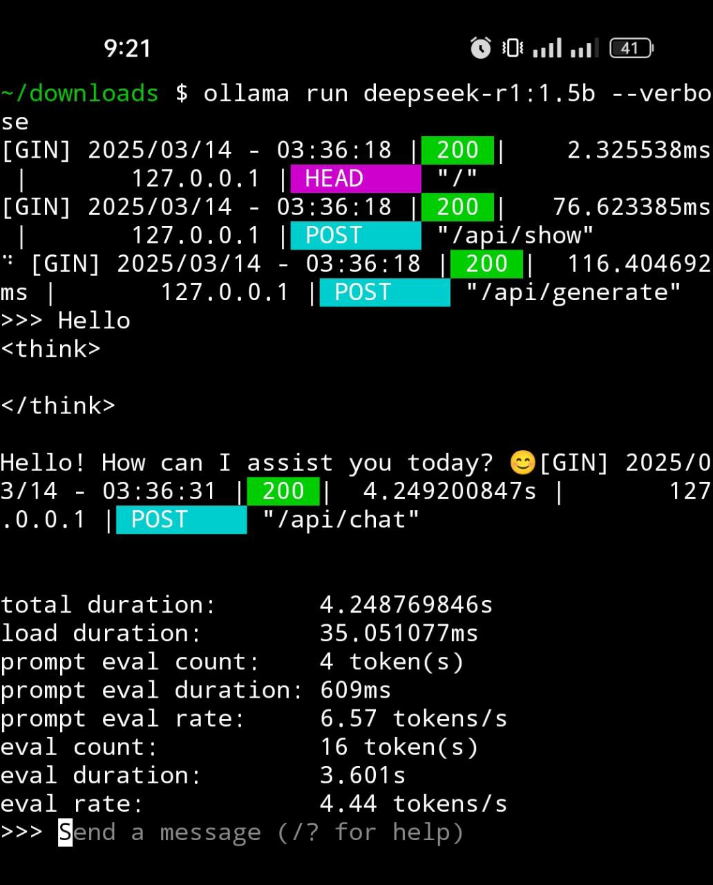
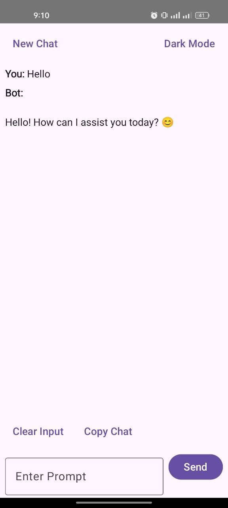

# Ollama User Guide

## Why I Created This Android Ollama Chat

I created this Android Ollama chat because I couldn't find any app for Android that allows chatting with the Ollama model. I use the `deepseek-r1:1.5b` model, but you can modify the source code to communicate with other models as well.

Here is an example of how to set the request body in Kotlin:
```kotlin
val requestBody = """
    {
        "model": "deepseek-r1:1.5b",
        "prompt": "$prompt"
    }
""".trimIndent()
```

I use Kotlin for the Android language, and there are some dependencies you should consider to make it work properly.

## Run Ollama on Android

This guide will help you run the DeepSeek-r1 AI model on your Android device using Termux and Ollama. Termux provides a Linux environment on Android, and Ollama helps manage and run large AI models locally.

## What is an AI Model?

An AI model is a program or algorithm that uses data to recognize patterns and make decisions. DeepSeek-r1 is an advanced AI model capable of understanding and generating text.

## What is Ollama?

Ollama is a platform that allows you to run large AI models on your local device. It helps manage and execute these models efficiently without relying on cloud services.

## Why Run AI Models Locally?

Running AI models on your device offers two main benefits:
1. **Instant Processing**: Everything is handled on your device, making it faster.
2. **Enhanced Privacy**: No need to send data to the cloud.

## Steps to Run DeepSeek-r1 on Android

### 1. Install Termux

Termux is a terminal emulator for Android that allows you to run a Linux environment. Download and install Termux from its [GitHub page](https://github.com/termux/termux-app) or from the [Play Store](https://play.google.com/store/apps/details?id=com.termux&pcampaignid=web_share).

### 2. Set Up Termux

After launching Termux, follow these steps:

- **Grant Storage Access**:
    ```sh
    termux-setup-storage
    ```
- **Update Packages**:
    ```sh
    pkg upgrade
    ```
    Enter `Y` when prompted.
- **Install Essential Tools**:
    ```sh
    pkg install git cmake golang
    ```

### 3. Install and Compile Ollama

Ollama is a platform for running large AI models locally. Here’s how to set it up:

- **Clone Ollama's Repository**:
    ```sh
    git clone --depth 1 https://github.com/ollama/ollama.git
    ```
- **Navigate to the Ollama Directory**:
    ```sh
    cd ollama
    ```
- **Generate Go Code**:
    ```sh
    go generate ./...
    ```
- **Build Ollama**:
    ```sh
    go build .
    ```
- **Start Ollama Server**:
    ```sh
    ./ollama serve &
    ```

### 4. Running DeepSeek-r1 Models

To run the DeepSeek-r1 model:

- **Choose a Model**: Models like `deepseek-r1:1.5b` (1.5 billion parameters) are available. You can visit [Ollama's official website](https://ollama.com/search) to find your model. I am using DeepSeek.
- **Download and Run the Model**:
    ```sh
    ./ollama run deepseek-r1:1.5b
    ```


### Optional Cleanup

- **Remove Unnecessary Files**:
    ```sh
    chmod -R 700 ~/go
    rm -r ~/go
    ```
- **Move Ollama Binary to a Global Path**:
    ```sh
    cp ollama/ollama /data/data/com.termux/files/usr/bin/
    ```

### 5. Verify Ollama is Running

To ensure that Ollama is running correctly, you can access it from your browser or any HTTP client:

- **Open Your Browser**:
    Navigate to `http://localhost:11434`. You should see a message indicating that "Ollama is running". The default port for Ollama is `11434`.

This step confirms that the Ollama server is up and running, and you can now interact with it using your Android device.

### 6. Build Your Own APK

You can now build your own APK to interact with the Ollama server. Follow these steps to create your APK:

- **Clone the Android Ollama UI Repository**:
    ```sh
    git clone https://github.com/nabin-8/Android-Ollama-UI.git
    ```
- **Open the Project in Android Studio**:
    Launch Android Studio and open the cloned project.
- **Build the APK**:
    Navigate to `Build > Build Bundle(s) / APK(s) > Build APK(s)`. This will generate the APK file you can install on your Android device.

Alternatively, you can use the pre-built APK available in my GitHub repository:

- **Download the APK**:
    Visit the [android-ollama-ui releases page](https://github.com/nabin-8/Android-Ollama-UI/releases) and download the latest APK.
- **Install the APK**:
    Transfer the APK to your Android device and install it.

Once installed, you can use the app to interact with the Ollama server running on your device.


## Conclusion

Running DeepSeek-r1 locally on your Android device using Termux and Ollama allows for faster and more private AI applications. This guide provides a simple and clear path to get started with on-device AI.

## Challenges

I faced several challenges, such as interacting with the model through endpoints. For the UI, I used Jetpack Compose, which required handling smooth scrolling, Material UI components, OkHttp for network requests, and ComposeMarkdown to display the UI in a good format.

## Future Improvements

There are many potential improvements for both the backend (Ollama) and the frontend. On the frontend, the UI can be made more user-friendly, the UX can be enhanced, and responses can be stored in SQLite or Room databases. Additional features like new chat functionalities, improved dark mode, and more can be added. This is version 1, and I plan to improve the frontend for Android, enhance the backend, and allow users to choose multiple models in the future.